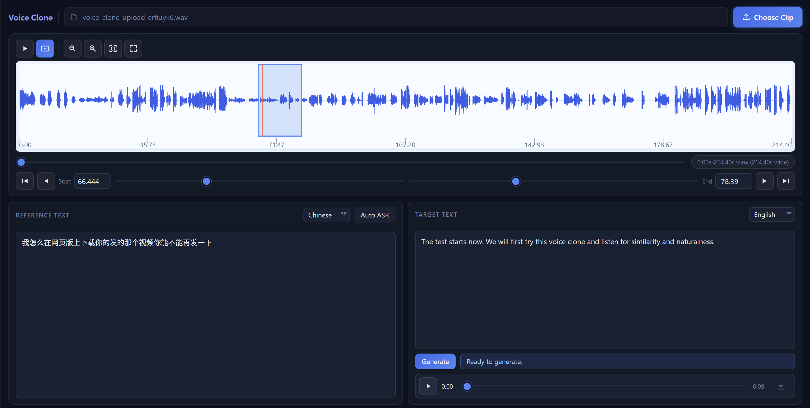

# Voice Clone Web

Standalone FastAPI + HTML/JS web UI for experimenting with voice cloning on top of `Qwen3-TTS`.

This repo intentionally does not include sample source clips, generated audio, cache files, or uploads.

## Preview



## Features

- Upload a source audio/video clip from the browser
- Inspect a zoomable waveform with seek, pan, and selection editing
- Drag to select the reference window and fine-tune its edges
- Run reference-language ASR with manual override
- Generate cloned audio in a separate output language
- Play generated output directly in the app

## Requirements

- Python 3.11+
- `ffmpeg` available on `PATH`
- `sox` available on `PATH`
- Enough disk space for uploaded media and extracted 24 kHz WAV cache files

The Python dependency file should not vendor `ffmpeg` or `sox`: they are native command-line tools, not Python packages. Install them separately, or set `FFMPEG_DIR` / `SOX_DIR` to the directory that contains each executable.

### Install System Tools

Windows:

```powershell
winget install ffmpeg
winget install sox
```

macOS:

```bash
brew install ffmpeg sox
```

Ubuntu/Debian:

```bash
sudo apt-get update
sudo apt-get install -y ffmpeg sox
```

## Install

```powershell
python -m venv .venv
.\.venv\Scripts\Activate.ps1
pip install --upgrade pip
pip install .
```

## Run

```powershell
.\.venv\Scripts\voice-clone-web
```

Then open `http://127.0.0.1:7861`.

## Dev Run

To run directly from `src/` without reinstalling after every edit:

```powershell
.\start-dev.ps1 --ip 127.0.0.1 --port 7861
```

This uses `.venv\Scripts\python.exe` and sets `PYTHONPATH` to `src` for the current process only.

## Notes

- By default this app stays on CPU because that was the more reliable path in this Windows setup.
- Uploaded clips, extracted cache WAVs, and generated outputs are written under `data/` and ignored by git.
- `Qwen3-TTS` is consumed as a dependency instead of vendoring or modifying its repo here.
- On startup, the app checks for both `sox` and `ffmpeg` and will fail fast with install hints if either one is missing.

## License

This project is released under the [MIT License](LICENSE).
